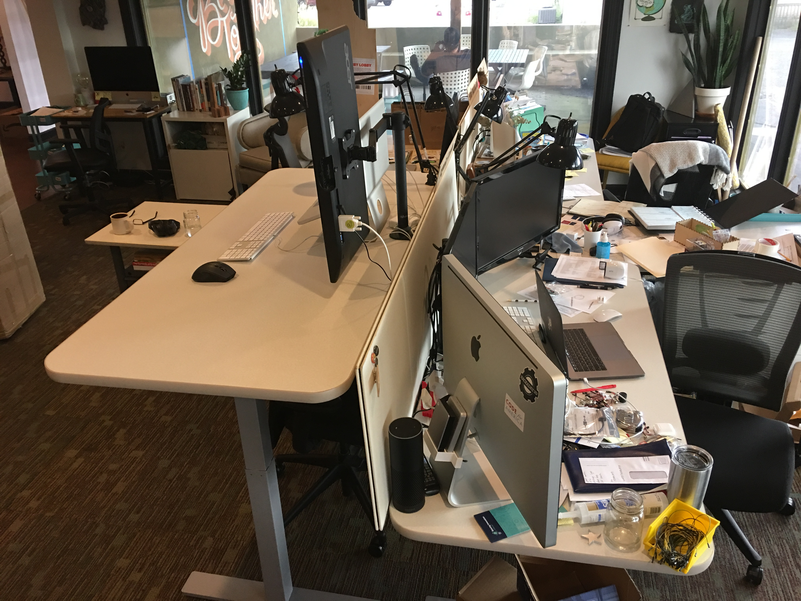
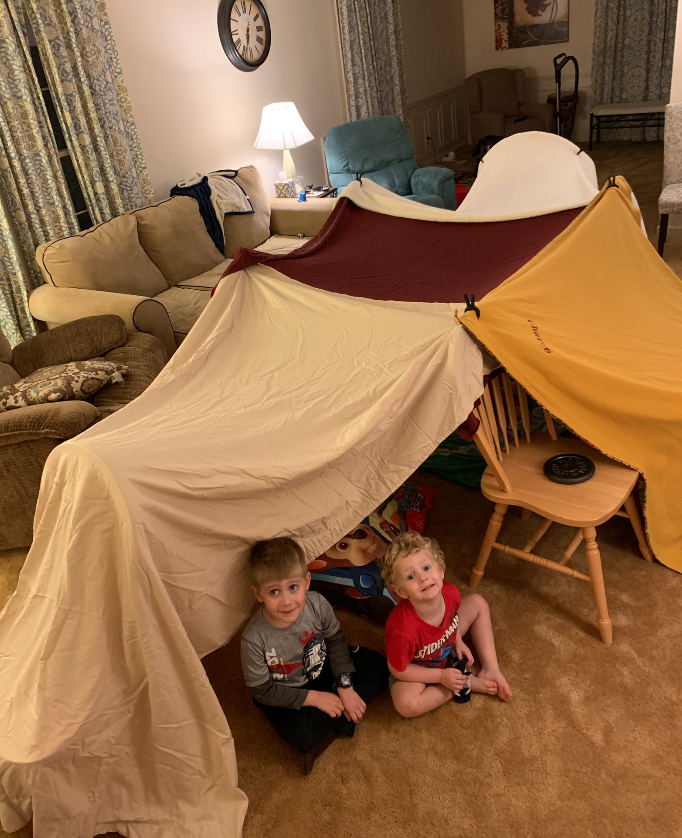
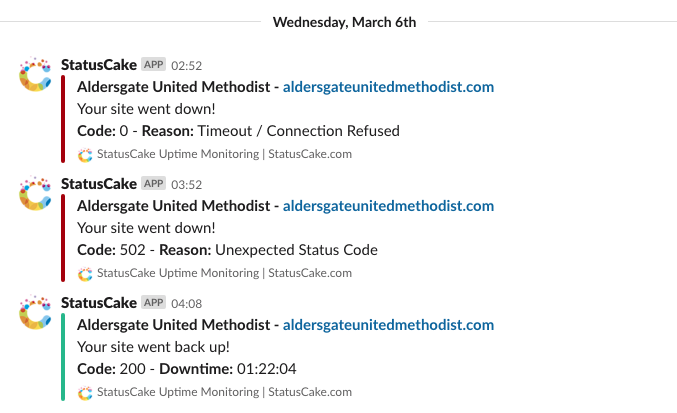
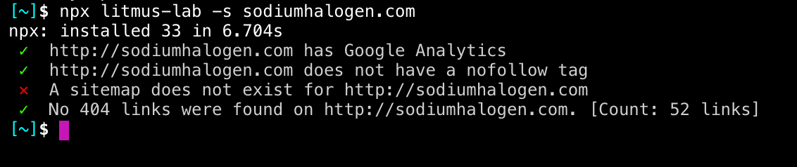

export { yellow as theme } from "mdx-deck/themes";

# Automate the Boring Stuff

---


---

## Save your time and brain for what needs your full attention.

---


---


---

## Tools you can use and how coding is part of your future.

---


## Chance @ Sodium Halogen

I build systems and automate stuff.

---

## Why should we automate?

---


---

## We don't have time or energy for everything.


---

## Why should we automate?

- save time

---

## Why should we automate?

- save time
- reduce errors

---

## Why should I automate?

- save time
- reduce errors
- save energy

---

## Sounds like essentialism

for humans.

---


---

## Essentialism

The disciplined pursuit of less

---



---

## Essentialism

Only paying attention to what matters right now.

---


---

## Let’s automate the non-essential.

---

## 3 Steps to Automation 🤖

---

## #1 Create a system

A series of simple steps to complete the work.

---

## #2 Automate parts

Create buttons to trigger some steps.

---

## #3 Delgate to the machine

Build a solution that only needs human oversight.

---

#1 Create a system

## Systems have the same benefits as automation

---

#1 Create a system

## Bullet Journaling

---

## Bullet Journaling

`- note`

---

## Bullet Journaling

`- note`

`• todo`

---

## Bullet Journaling

`- note`

`• todo`

`X todo (done)`

---

## Bullet Journaling

`- note`

`• todo`

`X todo (done)`

`> todo migrated to tomorrow`

---


---

## Bullet Journaling

morning

```
------
Saturday 3/16/19
------
• VTX Admin users/roles
• CS data import
• CS add table view
• 9a SH standup
• 3p VTX scrum
------
```

---

## Bullet Journaling

mid-day

```
------
Saturday 3/16/19
------
X VTX Admin users/roles
• CS data import
> CS add table view
X 9a SH standup
• 3p VTX scrum
- VTX scrum (zach, wm, visi, barrett)
  - timeline framework amChartjs
  - forcgraph blockers w zach
------
```

---

## Bullet Journaling

night

```
------
Saturday 3/16/19
------
X VTX Admin users/roles
> CS data import
> CS add table view
X 9a SH standup
X 3p VTX scrum
- VTX scrum (zach, wm, visi, barrett)
  - timeline framework amChartjs
  - forcgraph blockers w zach
- played on swing with boys
- built fort with boys
------
```

---



---

## Bullet Journaling

tomorrow

```
------
Sunday 3/16/19
------
> CS data import
> CS add table view
• get milk
• pickup bike
------
```

---

#2 Automate parts


---

#2 Automate parts

## Email Signature Generator

http://sodiumhalogen.com/clients/tlm/signature/

---

#2 Automate parts

## Tools for you

---

#2 Automate parts

## Tools for you

- Calendar (reminders, repeating events)

---

#2 Automate parts

## Tools for you

- Calendar
- IFTTT - https://ifttt.com/

---

#2 Automate parts

## Tools for you

- Calendar
- IFTTT
- Shortcuts ([iPhone](https://support.apple.com/guide/shortcuts/welcome/ios))

---

#2 Automate parts

## Tools for you

- Calendar
- IFTTT
- Shortcuts (iPhone)
- Zapier - https://zapier.com/apps/integrations/

---

#3 Delgate to the machine

## Website uptime



---

#3 Delgate to the machine

## Website error checker

Litmus Lab



---

#3 Delgate to the machine

## Code coverage

(next slide)

---


---

## If automation is the future, ⏳

...so is coding.

---

# Let's code something! 🙏 😩


---

# ✌️ Bye 👋


---

- https://github.com/chancesmith/simple-personal-page
- https://www.gatsbyjs.org/starters/gatsbyjs/gatsby-starter-blog/
